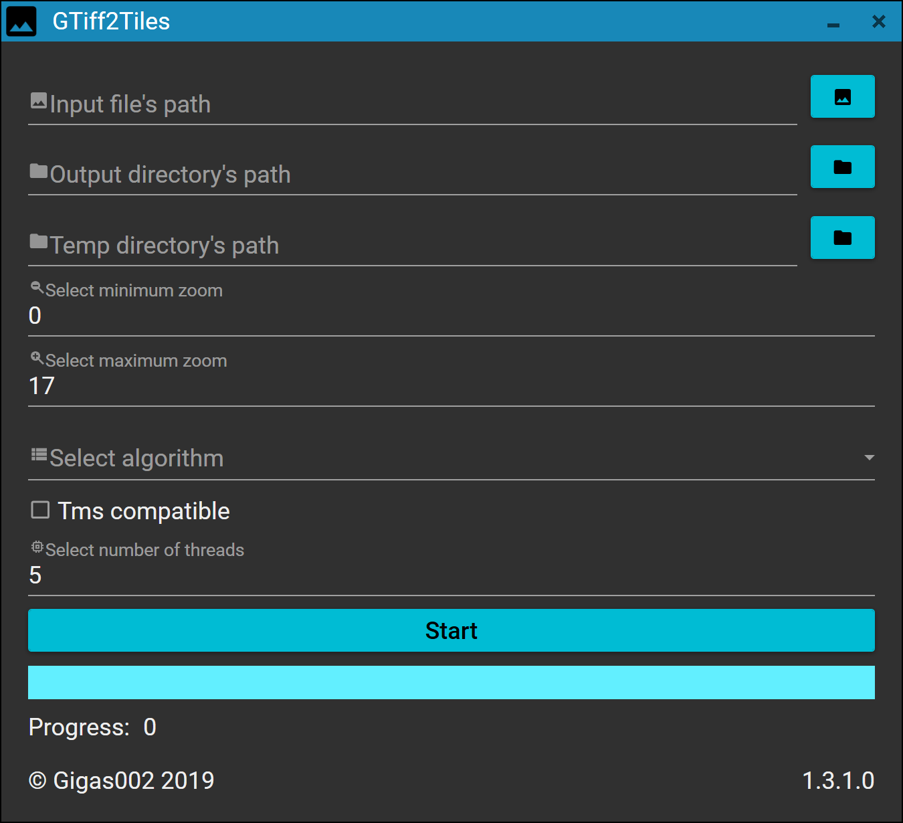

# GTiff2Tiles

Analogue of [gdal2tiles.py](https://github.com/OSGeo/gdal/blob/master/gdal/swig/python/scripts/gdal2tiles.py)/[MapTiler](https://www.maptiler.com/) on **C#**. Support **only GeoTIFF** as input data and creates **only geodetic 4 bands tiles** on output in [**tms**](https://wiki.osgeo.org/wiki/Tile_Map_Service_Specification)/**non-tms** (Google maps like) structure.

Solution can be build in **VS2019 (16.3.5+)**. You can also build projects in **VSCode (1.39.2+)** with **omnisharp-vscode (1.21.5+)** extensions. Projects targets **.NET Core 3.0**, so you’ll need **.NET Core 3.0 SDK**.

Icon is kindly provided by [Google’s material design](https://material.io/tools/icons/?icon=image&style=baseline) and is used in **GTiff2Tiles.GUI**, **GTiff2Tiles.Console** and **GTiff2Tiles.Benchmarks** projects.

**GTiff2Tiles** support any **GeoTIFF** (with less, than **5 bands**) on input. If it’s not **EPSG:4326** or not **8 bit**, then it will be converted by `Image.Gdal.Warp`, and saved to **temp** directory before cropping tiles.

## Table of contents

- [GTiff2Tiles](#gtiff2tiles)
  - [Table of contents](#table-of-contents)
  - [Current version](#current-version)
  - [Examples](#examples)
  - [GTiff2Tiles.Core](#gtiff2tilescore)
    - [Dependencies](#dependencies)
    - [Localization](#localization)
  - [GTiff2Tiles.Console](#gtiff2tilesconsole)
    - [Requirements](#requirements)
    - [Usage](#usage)
    - [Detailed options description](#detailed-options-description)
    - [Dependencies](#dependencies-1)
    - [Localization](#localization-1)
  - [GTiff2Tiles.GUI](#gtiff2tilesgui)
    - [Requirements](#requirements-1)
    - [Dependencies](#dependencies-2)
    - [Localization](#localization-2)
  - [GTiff2Tiles.Tests](#gtiff2tilestests)
    - [Dependencies](#dependencies-3)
  - [GTiff2Tiles.Benchmarks](#gtiff2tilesbenchmarks)
    - [Versions](#versions)
    - [Requirements](#requirements-2)
    - [Dependencies](#dependencies-4)
    - [Usage](#usage-1)
    - [Detailed options description](#detailed-options-description-1)
    - [Input data](#input-data)
    - [Arguments](#arguments)
    - [Results](#results)
  - [TODO](#todo)
  - [Contributing](#contributing)

Table of contents generated with [markdown-toc](http://ecotrust-canada.github.io/markdown-toc/ ).

## Current version

**Starting from 1.4.0 solution is rewritten on .NET Core 3.0 instead of .NET Framework 4.7.2/4.8!**

Current stable can be found here: , or on NuGet: .

Information about changes since previous releases can be found in [changelog](https://github.com/Gigas002/GTiff2Tiles/blob/master/CHANGELOG.md). This project supports [SemVer 2.0.0](https://semver.org/) (template is `{MAJOR}.{MINOR}.{PATCH}.{BUILD}`).

Previous versions can be found on [releases](https://github.com/Gigas002/GTiff2Tiles/releases) and [branches](https://github.com/Gigas002/GTiff2Tiles/branches) pages.

## Examples

In [Examples](https://github.com/Gigas002/GTiff2Tiles/tree/master/Examples/Input) directory you can find **GeoTIFFs** for some tests.

## GTiff2Tiles.Core

**GTiff2Tiles.Core** is a core library. [Here’s](https://github.com/Gigas002/GTiff2Tiles/wiki) the API documentation.

Library uses 2 different algorithms to create tiles:

- **Crop** – crops all the zooms from input file;
- **Join** – crops the lowest zoom from input file and then joins the upper images from built tiles.

### Dependencies

- [MaxRev.Gdal.Core](https://www.nuget.org/packages/MaxRev.Gdal.Core/) – 3.0.1.2;
- [MaxRev.Gdal.LinuxRuntime.Minimal](https://www.nuget.org/packages/MaxRev.Gdal.LinuxRuntime.Minimal/) – 3.0.1.2;
- [MaxRev.Gdal.WindowsRuntime.Minimal](https://www.nuget.org/packages/MaxRev.Gdal.WindowsRuntime.Minimal/) – 3.0.1.25;
- [NetVips](https://www.nuget.org/packages/NetVips/) – 1.1.0;
- [NetVips.Native](https://www.nuget.org/packages/NetVips.Native/) – 8.8.3;

### Localization

Localizable strings are located in `Localization/Strings.resx` file. You can add your translation (e.g. added `Strings.Ru.resx` file) and create pull request.

Currently, application is available on **English** and **Russian** languages.

## GTiff2Tiles.Console

**GTiff2Tiles.Console** is a console application, that uses methods from core to create tiles.

### Requirements

Application runs on **Linux x64**, **OSX x64**, **Windows x64** and **Windows x86** operating systems.

If you’re using Windows 7 SP1, you can experience weird error with **GDAL** package. It’s recommended to install [KB2533623](<https://www.microsoft.com/en-us/download/details.aspx?id=26764>) to fix it. You can read about this Windows update on [MSDN](<https://support.microsoft.com/en-us/help/2533623/microsoft-security-advisory-insecure-library-loading-could-allow-remot>).

### Usage

| Short |    Long     |                 Description                 | Required? |
| :---: | :---------: | :-----------------------------------------: | :-------: |
|  -i   |   --input   |           Full path to input file           |    Yes    |
|  -o   |  --output   |        Full path to output directory        |    Yes    |
|  -t   |   --temp    |         Full path to temp directory         |    Yes    |
|       |   --minz    |            Minimum cropped zoom             |    Yes    |
|       |   --maxz    |            Maximum cropped zoom             |    Yes    |
|  -a   | --algorithm |          Algorithm to create tiles          |    Yes    |
|       |    --tms    | Do you want to create tms-compatible tiles? |    Yes    |
|       |  --threads  |                Threads count                |    No     |
|       |  --version  |               Current version               |           |
|       |   --help    |        Message about console options        |           |

Simple example looks like this: `./GTiff2Tiles.Console -i "D:/Examples/Input.tif" -o "D:/Examples/Output" -t "D:/Examples/Temp" --minz 8 –maxz 11 -a crop --tms true --threads 3`

### Detailed options description

**input** is `string`, representing full path to input **GeoTIFF** file. Please, specify the path in double quotes (`“like this”`) if it contains spaces.

**output** is `string`, representing full path to directory, where tiles in will be created. Please, specify the path in double quotes (`“like this”`) if it contains spaces. **Directory should be empty.**

**temp** is `string`, representing full path to temporary directory. Please, specify the path in double quotes (`“like this”`) if it contains spaces. Inside will be created directory, which name is a **timestamp** in format `yyyyMMddHHmmssfff`.

**minz** is `int` parameter, representing minimum zoom, which you want to crop.

**maxz** is `int` parameter, representing maximum zoom, which you want to crop.

**algorithm** is `string`, representing cropping algorithm. Can be **crop** or **join**. When using **crop**, the input image will be cropped for each zoom. When using **join**, the input image will be cropped for the lowest zoom, and the upper tiles created by joining lowest ones.

**tms** is `string`, which shows if you want to create tms-compatible or non-tms-compatible tiles on output. Can have values `true` or `false`.

**threads** is `int` parameter, representing threads count. By default (if not set) uses **5 threads**.

### Dependencies

- GTiff2Tiles.Core;
- [CommandLineParser](https://www.nuget.org/packages/CommandLineParser/) – 2.6.0;

### Localization

Localizable strings are located in `Localization/Strings.resx` file. You can add your translation (e.g. added `Strings.Ru.resx` file) and create pull request.

Currently, application is available on **English** and **Russian** languages.

## GTiff2Tiles.GUI

**GTiff2Tiles.GUI** is a very simple GUI, that has the same methods and parameters, as **GTiff2Tiles.Console**:

### Requirements

Application runs on **Windows x64** and **Windows x86** operating systems.

If you’re using Windows 7 SP1, you can experience weird error with **GDAL** package. It’s recommended to install [KB2533623](<https://www.microsoft.com/en-us/download/details.aspx?id=26764>) to fix it. You can read about this Windows update on [MSDN](<https://support.microsoft.com/en-us/help/2533623/microsoft-security-advisory-insecure-library-loading-could-allow-remot>).

### Dependencies

- GTiff2Tiles.Core;
- [Caliburn.Micro](https://www.nuget.org/packages/Caliburn.Micro) – 3.2.0;
- [MaterialDesignColors](https://www.nuget.org/packages/MaterialDesignColors) – 1.2.0;
- [MaterialDesignThemes](https://www.nuget.org/packages/MaterialDesignThemes) – 2.6.0;
- [MaterialDesignExtensions](https://www.nuget.org/packages/MaterialDesignExtensions) – 2.8.0;

### Localization

Localizable strings are located in `Localization/Strings.resx` file. You can add your translation (e.g. added `Strings.Ru.resx` file) and create pull request.

Currently, application is available on **English** and **Russian** languages.

## GTiff2Tiles.Tests

**GTiff2Tiles.Tests** is a unit test project for **GTiff2Tiles.Core**.

### Dependencies

- GTiff2Tiles.Core;
- [Microsoft.NET.Test.Sdk](https://www.nuget.org/packages/Microsoft.NET.Test.Sdk) – 16.3.0;
- [NUnit](https://www.nuget.org/packages/NUnit) – 3.12.0;
- [NUnit3TestAdapter](https://www.nuget.org/packages/NUnit3TestAdapter/) – 3.15.1;

## GTiff2Tiles.Benchmarks

The following benchmarks were made at **06.07.2019**.

**MapTiler Pro** was running as process *maptiler.exe*, **GTiff2Tiles** tiling was called from library and **gdal2tiles.py** was converted by **PyInstaller** into *Gdal2Tiles.exe* and was running as process.

Unfortunately, I couldn’t create *Gdal2Tiles.exe* with **multiprocessing**, so it’s only in **single-threaded** tests at the moment. I’ll try to fix that moment in the future and update tests as well.

Time format in tables: `{minutes}:{seconds}:{milliseconds}`.

Benchmarks were made on PC with **Windows 10 x64 (18362.239)** equipped with **Intel Core i7 6700K 4.0 GHz**.

### Versions

Used **MapTiler Pro** version is **0.5.3**. Used **Gdal2Tiles** version is a script from **[GDAL repo](https://github.com/OSGeo/gdal/blob/master/gdal/swig/python/scripts/gdal2tiles.py)** (GDAL’s version **3.0.0**). Used **GTiff2Tiles.Core** version is **1.2.0.139**.

### Requirements

- MapTiler Pro 0.5.3 or newer;
- Gdal2Tiles.py, converted to `.exe` and placed in directory `Gdal2Tiles` near benchmarks binaries;

If you’re using Windows 7 SP1, you can experience weird error with **GDAL** package. It’s recommended to install [KB2533623](<https://www.microsoft.com/en-us/download/details.aspx?id=26764>) to fix it. You can read about this Windows update on [MSDN](<https://support.microsoft.com/en-us/help/2533623/microsoft-security-advisory-insecure-library-loading-could-allow-remot>).

### Dependencies

- GTiff2Tiles.Core;
- [CommandLineParser](https://www.nuget.org/packages/CommandLineParser/) – 2.6.0;

### Usage

| Short |   Long    |          Description          | Required? |
| :---: | :-------: | :---------------------------: | :-------: |
|  -i   |  --input  |    Full path to input file    |    Yes    |
|  -o   | --output  | Full path to output directory |    Yes    |
|  -t   |  --temp   |  Full path to temp directory  |    Yes    |
|       |  --minz   |     Minimum cropped zoom      |    Yes    |
|       |  --maxz   |     Maximum cropped zoom      |    Yes    |
|       | --threads |         Threads count         |    No     |
|       | --version |        Current version        |           |
|       |  --help   | Message about console options |           |

Simple example looks like this: `./GTiff2Tiles.Benchmarks -i "D:/Examples/Input.tif" -o "D:/Examples/Output" -t "D:/Examples/Temp" --minz 8 –maxz 11 --threads 3`

### Detailed options description

**input** is `string`, representing full path to input **GeoTIFF** file. Please, specify the path in double quotes (`“like this”`) if it contains spaces.

**output** is `string`, representing full path to directory, where tiles in will be created. Please, specify the path in double quotes (`“like this”`) if it contains spaces. **Directory should be empty.**

**temp** is `string`, representing full path to temporary directory. Please, specify the path in double quotes (`“like this”`) if it contains spaces. Inside will be created directory, which name is a **timestamp** in format `yyyyMMddHHmmssfff`.

**minz** is `int` parameter, representing minimum zoom, which you want to crop.

**maxz** is `int` parameter, representing maximum zoom, which you want to crop.

**threads** is `int` parameter, representing threads count. By default (if not set) uses **5 threads**.

### Input data

As input data was used **4326** GeoTIFF, located in repo’s directory: `Examples/Input/Benchmark.tif`.

### Arguments

The differences between tests are only in **maximum zoom** and **threads count** values.

**GTiff2Tiles** was running with the following arguments: `-i {inputFilePath} -o {outputDirectoryPath} -t {tempDirectoryPath} --tms true --minz 0 --maxz {maxZ} --threads {threadsCount}`.

**MapTiler Pro** was running with the following arguments: `-geodetic -tms -resampling cubic -f png32 -P {threadsCount} -o {outputDirectoryPath} -work_dir {tempDirectoryPath} -srs EPSG:4326 -zoom 0 {maxZ} {inputFilePath}`.

**Gdal2Tiles** was running with the following arguments: `-s EPSG:4326 -p geodetic -r cubic --tmscompatible -z 0-{maxZ} {inputFilePath} {outputDirectoryPath}`.

### Results

- Threads count = 1;
- Maximum zoom = 16;

| GTiff2Tiles | MapTiler Pro | Gdal2Tiles |
| :---------: | :----------: | :--------: |
|  00:27:061  |  00:33:901   | 01:45:901  |

- Threads count = 5;
- Maximum zoom = 16;

| GTiff2Tiles | MapTiler Pro |
| :---------: | :----------: |
|  00:07:723  |  00:15:057   |

- Threads count = 1;
- Maximum zoom = 17;

| GTiff2Tiles | MapTiler Pro | Gdal2Tiles |
| :---------: | :----------: | :--------: |
|  01:41:500  |  02:13:183   | 06:43:683  |

- Threads count = 5;
- Maximum zoom = 17;

| GTiff2Tiles | MapTiler Pro |
| :---------: | :----------: |
|  00:30:915  |  00:53:502   |

## TODO

You can track, what’s planned to do in future releases on [projects](https://github.com/Gigas002/GTiff2Tiles/projects) page.

## Contributing

Feel free to contribute, make forks, change some code, add [issues](https://github.com/Gigas002/GTiff2Tiles/issues), etc.
